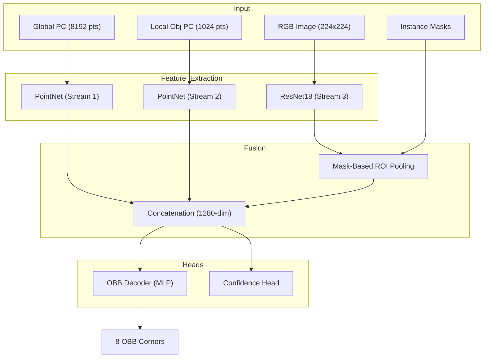

# 3D Bounding Box Prediction — Architecture & Design

This document outlines the technical decisions and architectural choices for the Sereact 3D Detection challenge.

## 1. System Architecture

The pipeline uses a **Three-Stream Multimodal Fusion** approach to combine global spatial context, local geometric resolution, and rich visual textures.

## 2. Technical Design Decisions

### A. Non-Ambiguous Rotation (SO(3))
Instead of regressing Euler angles (which suffer from gimbal lock and discontinuities), we utilize a **Continuous 6D Rotation Representation**. 
- The model predicts two unconstrained 3D vectors.
- A **Gram-Schmidt orthonormalization** process converts these into a valid rotation matrix $R \in SO(3)$.
- This ensures the predicted box is always perfectly orthogonal and never "skewed."

### B. Symmetry-Aware Loss
To handle the 180-degree rotational ambiguity of rectangular boxes, we implement a **Min-Distance Symmetry Loss**. The model calculates the rotation error against all 4 valid 180-degree rotations of the box and optimizes for the minimum distance, preventing gradient oscillations.

### C. Local Point Normalization
Each object's point cloud is **centered at $(0,0,0)$** before entering the local PointNet stream. This decouples "Shape" from "Global Position," allowing the local stream to specialize in geometry while the global streams specialize in localization.

### D. Multi-Modal Consistency
We implement **Synchronized Orthogonal Augmentations**. Every 90-degree rotation or mirror-flip applied to the 3D points is simultaneously applied to the RGB pixels and instance masks. This preserves the 2D-3D spatial contract throughout training.

## 3. Metrics & Verification

We measure performance using two primary high-level metrics:
1.  **3D IoU (BEV+Height)**: Measures the volume overlap between the predicted and ground truth boxes. (Industry standard for detection).
2.  **Corner RMSE (Meters)**: Measures the physical distance error of the box corners. Provides a human-readable "precision" score (e.g., "Accurate within 3cm").

## 4. Deployment Readiness
The model includes an `export_onnx.py` utility to convert the trained weights into an **ONNX** graph, enabling low-latency inference on CPU, GPU (TensorRT), or edge devices.
