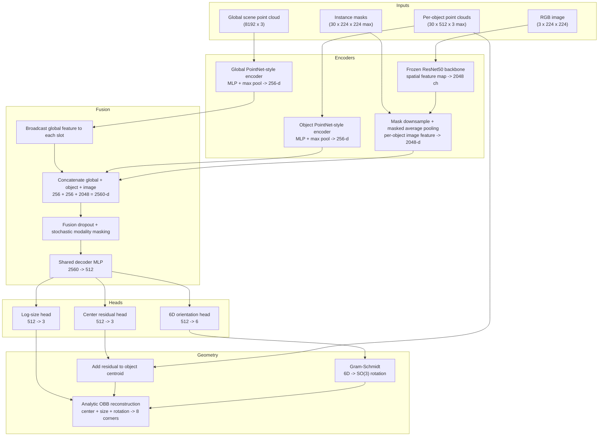

# Sereact 3D OBB Detection — Architecture & Design

This document describes the current architecture implemented in the repository.

## 1. System Architecture

The model is a three-stream multimodal detector that predicts oriented 3D boxes as geometric components rather than unconstrained corner coordinates.

## 2. Design Notes

### A. Three Complementary Streams

The detector combines three different views of each object:

- global scene geometry from the full point cloud
- local object geometry from mask-extracted object points
- local appearance from mask-pooled RGB features

This split lets the network keep scene context while still preserving per-object detail.

### B. Geometrically Valid Output Parameterization

The model does not regress raw corners directly. Instead it predicts:

- box center
- box size in log-space
- orientation as a continuous 6D representation

The 6D orientation is converted to a valid rotation matrix with Gram-Schmidt orthonormalization, then corners are reconstructed from a fixed canonical box template. This guarantees orthogonal boxes with positive side lengths.

### C. Residual Center Prediction

The center head predicts an offset from the per-object point cloud centroid instead of an absolute center from scratch. This keeps localization anchored to object geometry and reduces the burden on the decoder.

### D. Mask-Aligned RGB Pooling

The image stream uses the instance mask as a spatial prior. After the RGB backbone produces a feature map, the mask is resized to the same resolution and used for masked average pooling. This forces the visual descriptor to summarize the object region rather than the whole image.

### E. Modality Regularization

During training, the fused representation is regularized with:

- dropout on the fused feature vector
- stochastic modality masking on the global point, object point, and image branches

This reduces over-reliance on any single modality.

## 3. Training Objective

The loss in [`metrics.py`](metrics.py) supervises OBB components directly:

- center loss: L1 on box centroids
- size loss: L1 on log box dimensions
- orientation loss: symmetry-aware geodesic distance on `SO(3)`

The orientation term only keeps the upright yaw-180 symmetry used in the current code. It is also reliability-weighted so that nearly cubic boxes do not dominate heading supervision.

For reporting, the pipeline also computes:

- 3D IoU using axis-aligned BEV overlap times vertical overlap
- corner RMSE in meters

## 4. Data Handling and Augmentation

Each training sample is converted into:

- a global point cloud sampled to 8192 points
- up to 30 object slots
- 512 points per object slot
- resized masks and RGB inputs at 224 x 224

Training augmentation is synchronized across modalities:

- 90 degree yaw rotations with small angular jitter
- optional horizontal and vertical flips
- local object scale perturbation
- point jitter
- occasional RGB inversion

This preserves alignment between 3D geometry, image content, and masks.

## 5. Deployment

[`export_onnx.py`](export_onnx.py) exports the trained model to ONNX. The exported graph keeps the multimodal forward signature:

- `pc`
- `obj_pc`
- `obj_indices`
- `rgb`
- `mask`

and returns:

- `center`
- `size`
- `R`
- `log_size`
